# AegisOps Project Guide - Hinglish Edition

Ye document AegisOps project ka complete high-level aur implementation-level guide hai. Iska goal ye hai ke koi bhi engineer project open kare aur samajh jaye:

- AegisOps kya karta hai
- Architecture kaisi hai
- Frontend, backend, gateway, queues, database, telemetry, AI RCA, notifications aur SDKs ka role kya hai
- Local development kaise chalti hai
- Production packaging ka direction kya hai
- Codebase folder structure ka matlab kya hai

## 1. AegisOps Kya Hai

AegisOps ek AI-powered monitoring aur DevOps/SRE operations platform hai. Iska main kaam monitored projects se logs, metrics, deployments, incidents aur notifications ko centralize karna hai. Platform engineers aur SREs dashboard se ye kaam kar sakte hain:

- Projects aur services connect karna
- API keys generate karna
- Logs aur metrics ingest karna
- Service health, dashboards aur SLOs dekhna
- Incidents manage karna
- AI RCA aur investigation run karna
- Deployment impact analyze karna
- Notification routes aur escalation policies manage karna
- Reports generate karna
- Audit logs aur team management handle karna

## 2. High-Level System Design

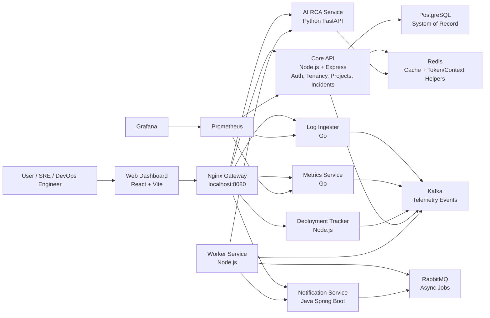

Simple words mai: user dashboard use karta hai, dashboard gateway ko call karta hai, gateway request ko correct service tak route karta hai. Core API main business data own karti hai. Logs/metrics/deployments ingestion services Kafka events publish karti hain. Worker service background jobs aur AI/notification orchestration handle karti hai.

## 3. Active Services

| Service | Runtime | Port | Responsibility |
| --- | --- | ---: | --- |
| Web Dashboard | React + Vite | 5173 | UI, navigation, auth screen, monitoring pages |
| Nginx Gateway | Nginx image | 8080 | Single entrypoint, CORS, route proxy |
| Core API | Node.js + Express | 4000 | Auth, orgs, projects, services, API keys, incidents, reports, audit |
| Log Ingester | Go | 5001 | Log ingestion, API key validation, Kafka publish |
| Metrics Service | Go | 5002 | Metric ingestion, custom metrics, aggregate queries |
| AI RCA Service | Python FastAPI | 8000 | Incident analysis, log summaries, postmortem drafts |
| Notification Service | Java Spring Boot | 8085 | Email/Slack/Discord route settings, history, escalation policies |
| Deployment Tracker | Node.js | 4010 | Deployment webhook events and impact records |
| Worker Service | Node.js | host process | Kafka/RabbitMQ consumers and async orchestration |
| PostgreSQL | Docker image | 5432 | Main persistent data store |
| Redis | Docker image | 6379 | Cache, health dependency, token/context support |
| Kafka | Docker image | 9094 | Event streaming |
| RabbitMQ | Docker image | 5672/15672 | Job queue and management UI |
| Prometheus | Docker image | 9090 | Metrics scraping |
| Grafana | Docker image | 3000 | Metrics visualization |

## 4. Gateway Route Design

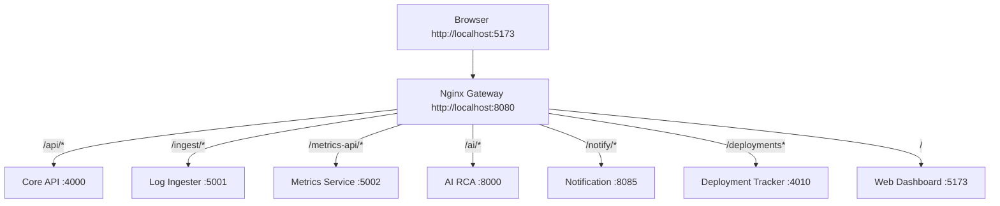

Important gateway notes:

- Browser ko mostly `localhost:8080` gateway use karna chahiye for cross-service calls.
- Nginx upstream services ke duplicate CORS headers hide karta hai, phir single valid CORS header set karta hai.
- `/deployments` route deployment tracker ko proxy hota hai.
- `/api/docs/openapi.json` Core API OpenAPI schema expose karta hai.

## 5. Authentication Aur Tenant Isolation

AegisOps ka auth JWT-based hai:

- User register karta hai
- Core API user aur organization create karti hai
- Access token short-lived hota hai
- Refresh token database mai hashed store hota hai
- Dashboard token localStorage mai session ke liye save karta hai
- Dashboard har Core API request ke saath `Authorization: Bearer <token>` bhejta hai
- Core API organization membership verify karti hai

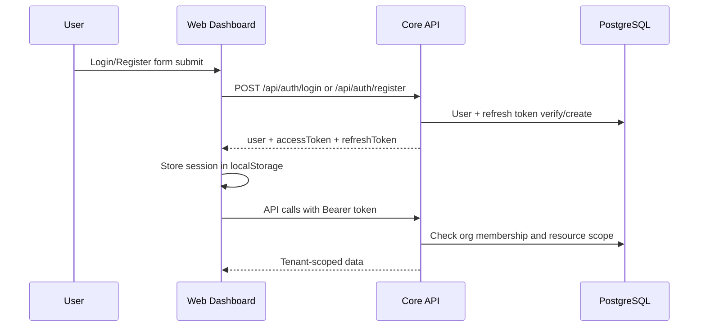

Tenant isolation ka flow:

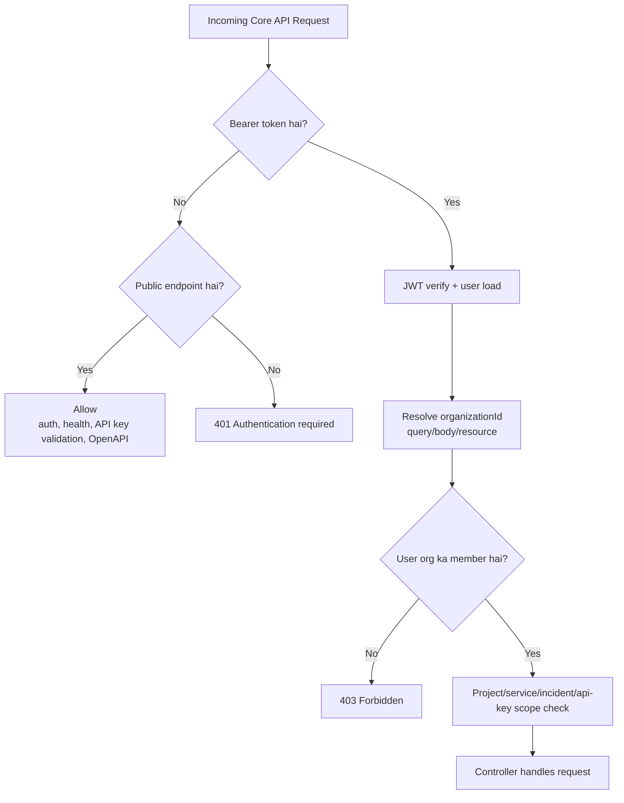

API key validation public rakha gaya hai because log-ingester aur metrics-service apni ingestion API key validate karne ke liye Core API ko call karte hain. Product data APIs auth ke peeche hain.

## 6. Frontend Architecture

Frontend `apps/web-dashboard` mai hai. Ye React + Vite + Tailwind based dashboard hai.

Main concepts:

- `app/App.tsx`: app shell, active route state, health polling
- `app/auth.tsx`: session provider, login/register/logout, token persistence
- `app/workspace.tsx`: selected environment aur time range state
- `app/navigation.ts`: sidebar navigation model
- `app/router.tsx`: active navigation label ko page component se map karta hai
- `shared/api/core.ts`: centralized API client and all backend wrappers
- `shared/layout`: shell, sidebar, topbar, command search
- `features/*`: product pages

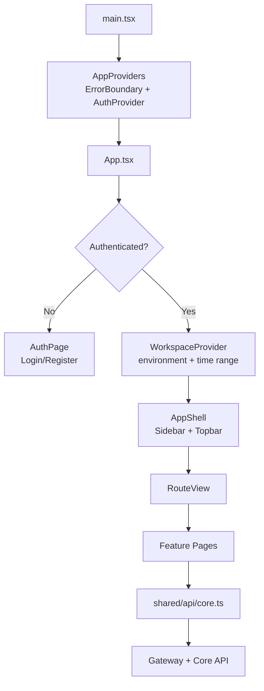

Topbar ka role:

- Command search
- Environment picker
- Time range picker
- Health status
- Documentation drawer
- Notifications drawer
- Profile menu with user/org and logout

Sidebar ka role:

- Overview
- Connect Project
- Projects/Services/Service Catalog
- Logs/Metrics/Dashboards
- Issues/Incidents/Alert Rules/SLOs/Synthetics
- AI RCA/AI Investigations
- Deployments/Releases/Reports
- Notifications/Team/Audit Logs/Settings

## 7. Backend Architecture

Core API main business brain hai. Iske modules:

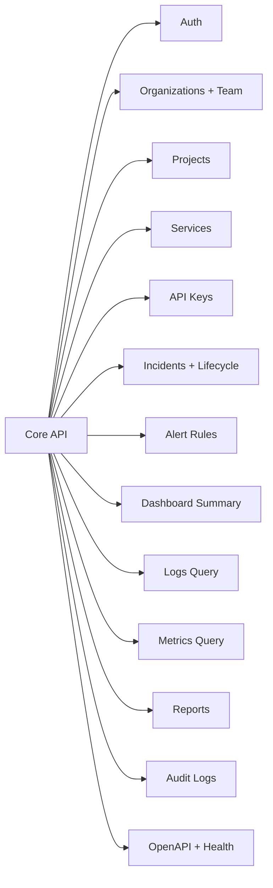

Core API important patterns:

- Express routers per module
- PostgreSQL repository layer
- Redis cache for repeated dashboard/detail queries
- Audit records on important mutations
- Auth middleware for org-scoped endpoints
- OpenAPI document route
- Prometheus metrics endpoint

## 8. Data Model Overview

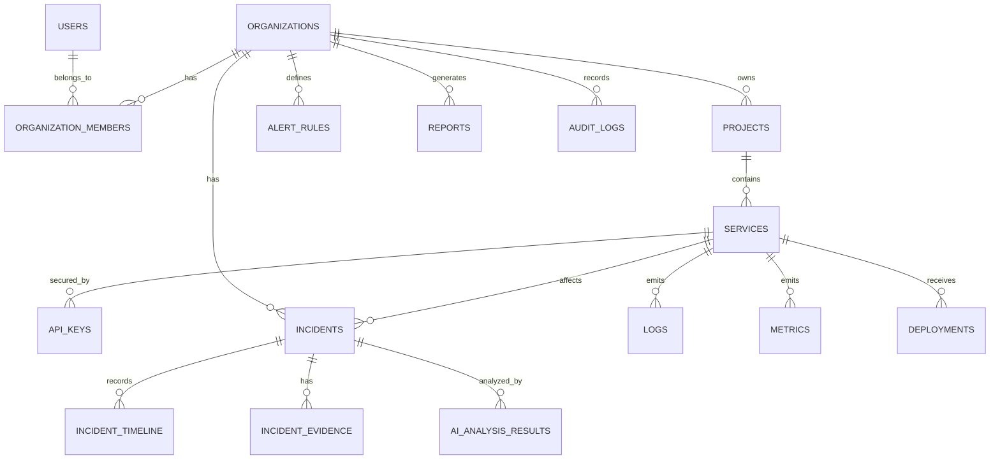

Core tables ka rough meaning:

- `users`: login identity
- `refresh_tokens`: refresh token hashes
- `organizations`: tenant/workspace
- `organization_members`: org membership and roles
- `projects`: monitored project/application
- `services`: project ke internal services
- `api_keys`: telemetry ingestion keys
- `logs`: PostgreSQL-backed searchable logs
- `metrics`: raw metric points
- `metric_aggregates`: bucketed metrics
- `incidents`: incident records
- `incident_timeline`: lifecycle events
- `incident_evidence`: evidence attached to incident
- `ai_analysis_results`: AI RCA outputs
- `alert_rules`: thresholds
- `audit_logs`: mutation/audit trail
- `reports`: generated reliability reports

## 9. Telemetry Ingestion Flow

Logs:

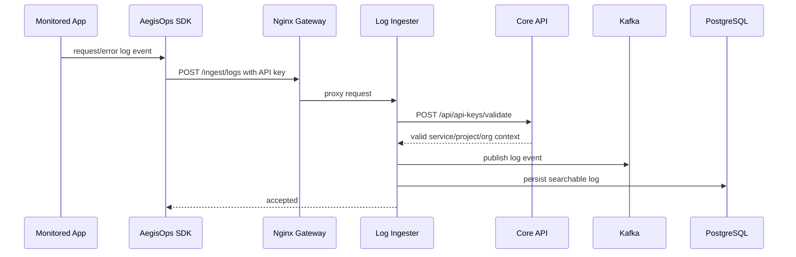

Metrics:

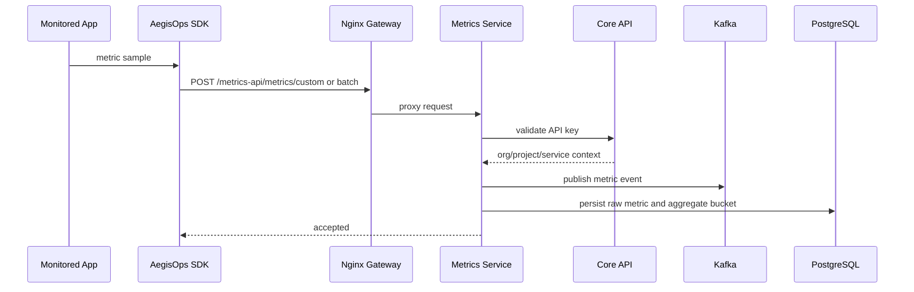

SDKs fail-safe hain. Agar AegisOps unavailable ho, monitored app crash nahi hoti.

## 10. Incident Aur AI RCA Flow

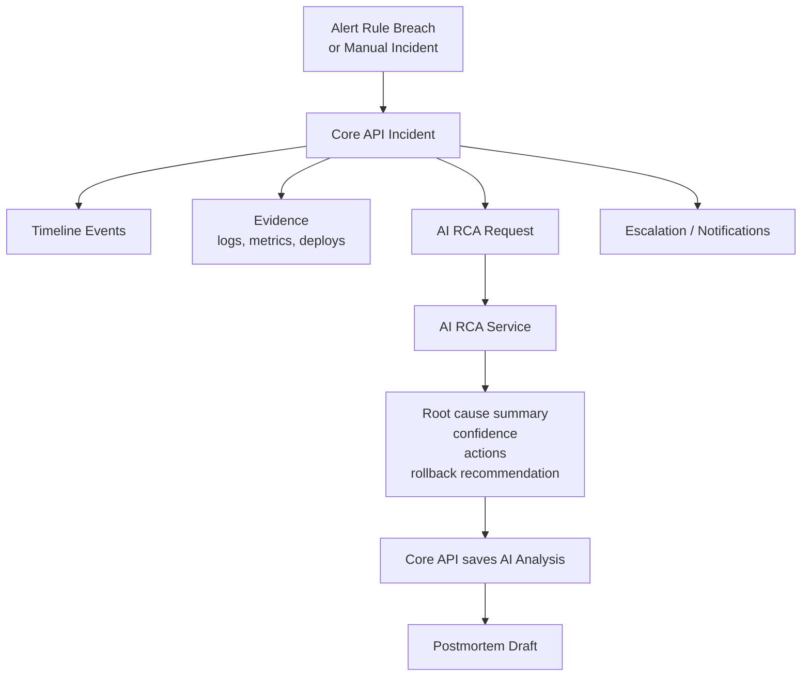

Incident lifecycle statuses:

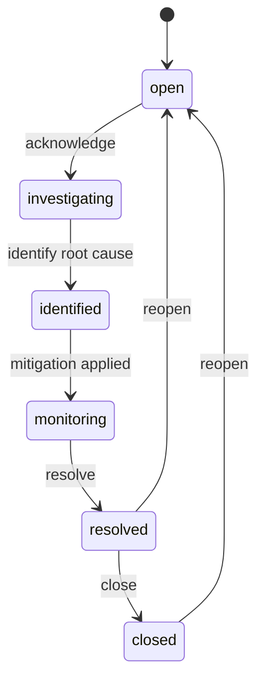

AI pages:

- `AI RCA`: selected incident/service/logs/metrics ke basis par analysis run karta hai
- `AI Investigations`: saved RCA, evidence, latest investigation result, postmortem draft handle karta hai

## 11. Deployment Tracking Aur Release Flow

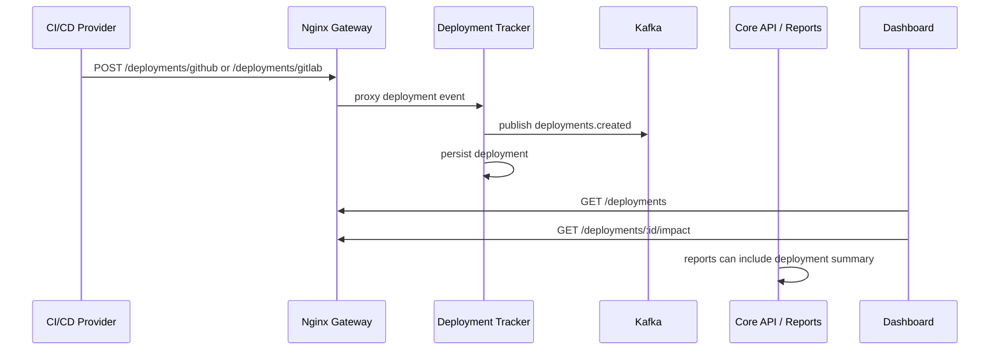

Releases page latest service versions, selected deployment metadata, impact data aur release-risk incidents show karta hai.

## 12. Notification Aur Escalation Flow

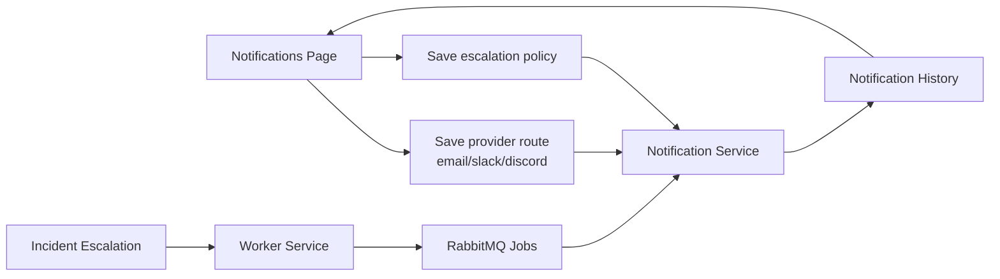

Notification service currently provider jobs ko accepted history ke form mai track karta hai. Routes:

- `/notify/settings/:orgId`
- `/notify/escalation-policies/:orgId`
- `/notify/history/:orgId`
- `/notify/email`
- `/notify/slack`
- `/notify/discord`

## 13. Alert Rules Aur SLOs

Alert Rules:

- Metric threshold create/update/delete/toggle
- Metric evaluation uses actual metric aggregates and logs
- Log evaluation uses real selected service logs
- Breach hone par incident pipeline trigger ho sakti hai

SLOs:

- Availability target
- Latency p95 target
- Error budget calculation
- Open incident visibility per service

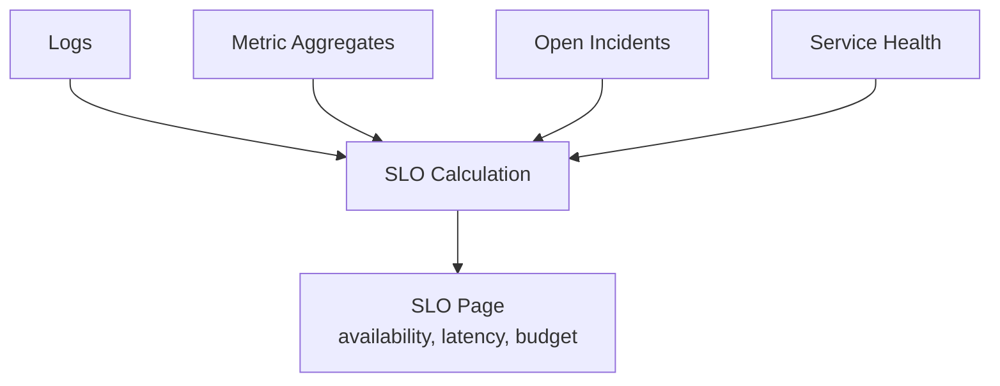

## 14. Reports Flow

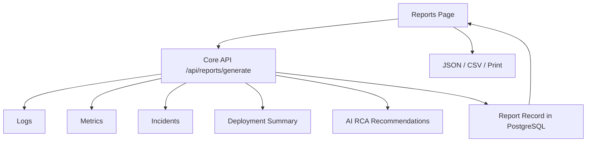

Report types:

- Daily Reliability
- Weekly Reliability
- Incident Report
- SLA Report
- Service Health
- Deployment Impact
- AI Postmortem
- Project Monitoring

## 15. SDK Aur Instrumentation Model

SDK packages:

- `packages/aegisops-node`
- `packages/aegisops-python`
- `packages/aegisops-java`
- `packages/aegisops-go`

Example apps:

- `examples/monolith-node-express`
- `examples/fastapi-service`
- `examples/go-http-service`
- `examples/springboot-service`

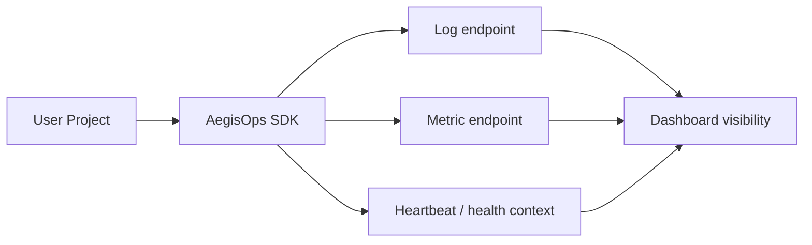

Connect Project flow:

1. Organization select hoti hai
2. Project create hota hai
3. Services create hoti hain
4. API keys generate hoti hain
5. SDK snippet show hota hai
6. Test event send hota hai
7. Connection status update hota hai

## 16. Local Development Architecture

Local development ka principle:

- Infrastructure Docker Compose se run hoti hai
- App services host machine runtimes se run hoti hain
- Custom app Docker images local dev mai build nahi hoti
- Dockerfiles production packaging ke liye repo mai hain

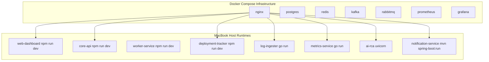

Run commands:

```bash
docker compose config
docker compose up -d
./start_services.sh
```

Validation:

```bash
npm run build                    # apps/web-dashboard
npm run build                    # services/core-api
docker compose config --quiet
./scripts/smoke-test.sh
```

## 17. Folder Structure

```text
AegisOps/
  apps/
    web-dashboard/          React dashboard
  services/
    core-api/               Main API and database-backed business modules
    log-ingester/           Go log ingestion API
    metrics-service/        Go metrics ingestion API
    ai-rca-service/         Python AI RCA API
    notification-service/   Java notification API
    deployment-tracker/     Node deployment API
    worker-service/         Node async workers
  packages/
    aegisops-node/          Node SDK
    aegisops-python/        Python SDK
    aegisops-java/          Java SDK
    aegisops-go/            Go SDK
  examples/
    monolith-node-express/
    fastapi-service/
    go-http-service/
    springboot-service/
  infra/
    nginx/
    prometheus/
    grafana/
  docs/
    architecture and integration docs
  scripts/
    smoke tests and seed helpers
```

## 18. Code Ownership Style

Industry-level structure ka direction:

- Frontend page-level code `features/*` mai
- Reusable UI `shared/ui`
- Layout `shared/layout`
- API client `shared/api`
- App state/providers `app/*`
- Backend domain modules `services/core-api/src/modules/*`
- Infrastructure adapters `services/*/src/infrastructure`
- Service-specific Dockerfiles production ke liye
- Local dev scripts root mai

## 19. Observability of AegisOps Itself

AegisOps khud bhi observable hai:

- Health endpoints per service
- Prometheus scrape targets
- Grafana datasource provisioning
- Core API Prometheus metrics
- Gateway health
- Dependency health checks for Postgres, Redis, Kafka, RabbitMQ

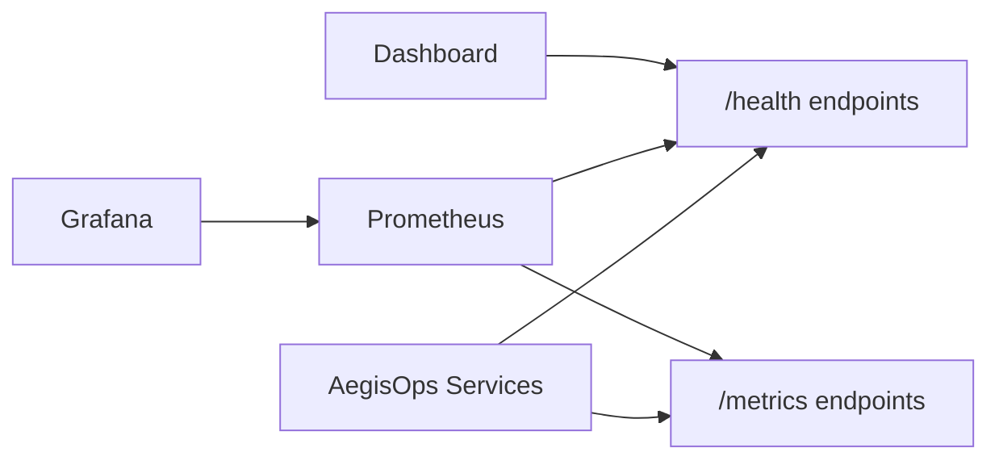

## 20. Security Notes

Current security foundation:

- JWT access token
- Refresh token hashing
- Organization membership checks
- Resource scope checks for project/service/incident/api-key
- API key lifecycle for telemetry ingestion
- API key validation endpoint for ingestion services
- Audit logs for important mutations
- CORS controlled at gateway

Important production hardening checklist:

- Strong `JWT_SECRET`
- HTTPS/TLS at ingress
- Secure cookie option if browser token storage strategy changes
- Provider secrets for Slack/Discord/email
- Rate limits on auth and high-risk mutation routes
- RBAC enforcement per role beyond membership checks
- External secret manager for production credentials

## 21. Current Product Surface

Dashboard pages:

- Overview
- Connect Project
- Projects
- Services
- Service Catalog
- API Keys
- Logs
- Metrics
- Dashboards
- Issues
- Incidents
- Alert Rules
- SLOs
- Synthetics
- Deployments
- Releases
- Reports
- AI RCA
- AI Investigations
- Notifications
- Team
- Audit Logs
- Settings

## 22. Request Lifecycle Example

Example: Dashboard service health load

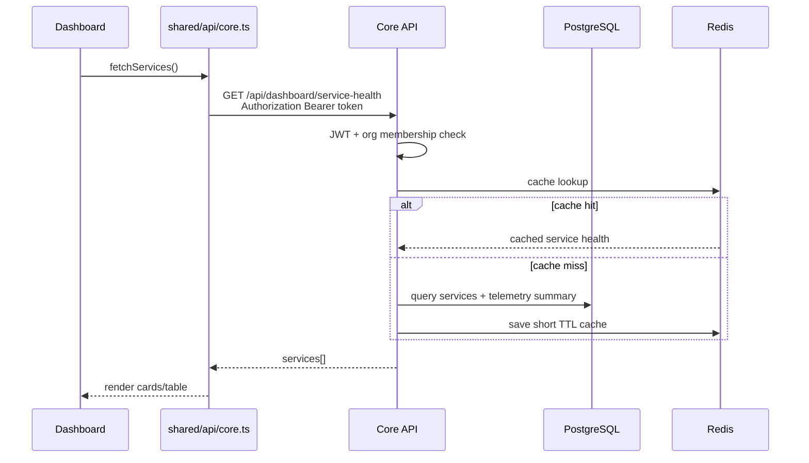

## 23. Production Direction

Local development host runtimes use karta hai. Production mai ye likely shape hoga:

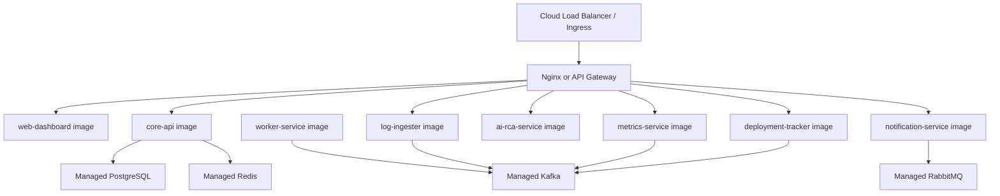

Production recommendations:

- Images CI/CD pipeline mai build hon
- App secrets env/secret manager se load hon
- DB migrations deployment step mai run hon
- Observability stack managed ya hardened ho
- Gateway CORS exact frontend origin per restricted ho
- Role-based authorization deeper enforce ho

## 24. Mental Model

AegisOps ko teen layers mai samjho:

1. Control Plane
   - Auth, org, projects, services, API keys, incidents, reports
   - Mostly Core API

2. Data Plane
   - Logs, metrics, deployment events, Kafka, PostgreSQL telemetry
   - Log Ingester, Metrics Service, Deployment Tracker

3. Intelligence Plane
   - AI RCA, investigations, postmortems, recommendations
   - AI RCA Service, Worker Service, Core API persistence

```mermaid
flowchart LR
  Control["Control Plane<br/>Core API + Dashboard"] --> Data["Data Plane<br/>Telemetry + Events"]
  Data --> Intelligence["Intelligence Plane<br/>AI RCA + Reports"]
  Intelligence --> Control
```

## 25. Engineer Handoff Summary

Jab project mai kaam start karo:

1. Pehle `docker compose config` run karo
2. Infra `docker compose up -d` se start karo
3. App services host runtimes se start karo
4. Dashboard login/register se session banao
5. Project/service connect karo
6. API key generate karo
7. SDK ya Generic HTTP se telemetry bhejo
8. Logs, metrics, service health, SLOs aur incidents verify karo
9. AI RCA aur reports run karo
10. Notification routes configure karo

Ye platform ka core idea hai: monitored apps ko lightweight SDK/API key se connect karo, telemetry ko durable store karo, incidents ko lifecycle mai manage karo, aur AI se RCA/postmortem acceleration do.
