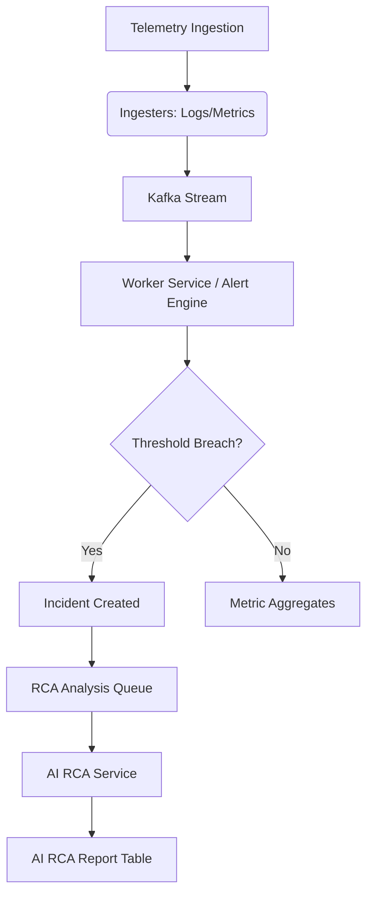

# AegisOps Monitoring Model

AegisOps uses a unified model linking telemetry ingestion to alerting, incident management, and AI-driven Root Cause Analysis (RCA).

## System Health & Metrics Ingestion

AegisOps ingests metrics via the `/metrics-api/metrics/custom` and `/metrics-api/metrics/batch` endpoints.

Standard HTTP Latency metrics supported:
- `http_request_duration_ms`
- `db_query_duration_ms`
- `external_api_duration_ms`
- `queue_job_duration_ms`

Scheduled rollups run in the worker service every 60 seconds. They use PostgreSQL `percentile_cont` to compute p50, p95, and p99 from raw metrics for 1m, 5m, 15m, 1h, and 1d windows.

Route performance is exposed through:
- `GET /api/v1/projects/:projectId/routes/performance`
- `GET /api/v1/projects/:projectId/services/:serviceId/routes/performance`

Supported infrastructure metric names include:
- Redis: `redis_cache_hit_ratio`, `redis_memory_used_bytes`, `redis_connected_clients`, `redis_evicted_keys_total`
- PostgreSQL: `postgres_connections_active`, `postgres_connections_max`, `postgres_query_duration_ms`, `postgres_deadlocks_total`, `postgres_cache_hit_ratio`
- Kafka: `kafka_messages_in_total`, `kafka_consumer_lag`, `kafka_topic_partition_count`, `kafka_broker_status`
- RabbitMQ: `rabbitmq_queue_depth`, `rabbitmq_messages_published_total`, `rabbitmq_messages_consumed_total`, `rabbitmq_messages_failed_total`

## Alerting & Incident Triggering

The Alert Rule Engine periodically evaluates rules against aggregated metrics. If a metric breaches a threshold (e.g. `http_request_duration_ms > 1000` for 60 seconds):
1. An alert is triggered.
2. A new Incident is opened in the database.
3. Incident evidence (e.g., matching raw metrics and logs) is captured and saved.
4. A task is published to RabbitMQ to generate an AI RCA report.

## AI RCA Engine

The AI RCA service picks up the analysis request, fetches recent logs, traces, and metrics, and produces:
- A clear plain-text incident summary.
- The likely root cause.
- A confidence score.
- Actionable recommendations (e.g. rollbacks or query optimizations).
- A post-mortem draft.
